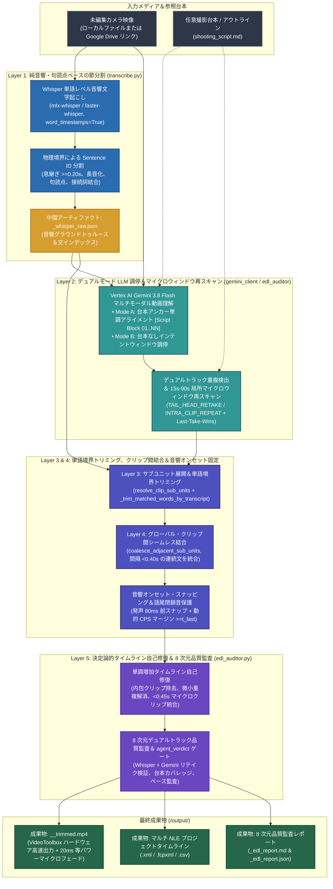

# Video Trimmer (`video-trimmer`)

[](https://github.com/sylphlin/video-trimmer/blob/main/LICENSE)
[](https://www.python.org/)
[]()
[](https://ffmpeg.org/)

[English (en)](README.md) | [繁體中文 (zh-TW)](README.zh-TW.md) | [简体中文 (zh-CN)](README.zh-CN.md) | [日本語 (ja)](README.ja.md) | [한국어 (ko)](README.ko.md)

---

## 概要 (Overview)

**Video Trimmer** は、トーク動画、チュートリアル、プレゼンテーション録画向けの AI 自動ラフカット＆トリミングエンジンです。**Google Vertex AI Gemini 3.8 Flash** のマルチモーダル動画推論、**Whisper 単語レベル音響タイムスタンプ**（`mlx-whisper`）、**5 レイヤー統合アーキテクチャ**、および **音響オンセット・スナッピング** を組み合わせ、NG テイクや言い淀み、無音区間を自動除去しながら自然な連続発話を維持し、NLE タイムライン（`.xml`, `.fcpxml`, `.csv`）、8 次元品質監査レポート（`.md`, `.json`）、および MP4 動画を出力します。

---

## 5 レイヤー統合アーキテクチャと主な機能



1. **レイヤー 1：純音響・句読点ベースの節分割 (`transcribe.py`)**：
   - 息継ぎ休止（`gap >= 0.20s`）、言い淀みによる長音化（`word_dur >= 1.20s`）、句読点閉鎖、および話者交替の物理境界のみで `Sentence ID` を分割し、微細休止（`gap < 0.25s`）を跨ぐ接続詞結合（`CONJUNCTIONS`）を保持します。Python 側の文字列類似度によるリテイク推測は一切行いません。
2. **レイヤー 2：デュアルモード LLM テイク選定＆局所マイクロウィンドウ再スキャン (`gemini_client.py` / `edl_auditor.py`)**：
   - **Mode A：スクリプトアンカー単調アライメント（台本指定時）**：単一情報源（SSOT）パーサー（`extract_script_blocks`）により YAML フロントマター、ト書き、非発話メタデータ行（`Title:`, `Subject:`, `Outline:`, `標題：`, `主題：`, `內文：` など）を除外して `[Script Block 01] .. [Script Block NN]` に整形し、プロンプトと監査器の間で 100% 番号を一致させ、各ブロック最大 1 つの最終成功テイクのみを採用します（`Last-Take-Wins`）。
   - **Mode B：台本なしインテントウィンドウ調停（台本省略時）**：途中放棄された断片（Abandoned Fragment）を除去しつつ、意図的な反復強調表現（3 回繰り返す強調など）を保護します。
   - **局所マイクロウィンドウ再スキャン＆マルチモーダル・リテイク調停（`edl_auditor.py`）**：台本ブロック長 `len(block_norm)` を唯一の分母としてカバレッジを算出します（`_script_block_coverage_score`）。欠落ブロック、未アンカークリップ、クリップ間末尾・先頭リテイク（`TAIL_HEAD_RETAKE`）、クリップ内反復（`INTRA_CLIP_REPEAT`）、または同一ブロック複数テイク衝突（`SCRIPT_TAKE_COLLISION`）を検出した場合、該当する `15s–90s` の短区間のみを `VideoMetadata` で再スキャン後、`Last-Take-Wins` 重複排除を適用します。
3. **レイヤー 3：サブユニット展開と単語境界トリミング (`resolve_clip_sub_units`)**：
   - 複数文の範囲を個別の `Sentence ID` に展開し、`transcript` に合わせて語頭・語尾の Whisper 単語境界（`_trim_matched_words_by_transcript`、最右部分列アンカリングと短語アライメント）を精密に整列させます。
4. **レイヤー 4：グローバル・クリップ間結合 (`coalesce_adjacent_sub_units`)**：
   - 隣接クリップが連続する `Sentence ID`（スキップされた NG 文がなく、境界がリテイク用にトリミングされていない場合）であり、単語間ギャップが `< 0.40s` の場合、単一の連続クリップに自動統合し、文中の不自然なジャンプカットを排除します。
5. **レイヤー 5：決定論的タイムライン自己修復＆ 8 次元デュアルトラック品質監査 (`edl_auditor.py`)**：
   - 時系列の厳密な単調増加（`source_in < source_out` および `c[i].source_out <= c[i+1].source_in`）を強制し、内包された冗長クリップの除去、境界の微小重複解消、`source_out >= t_last` の保証、`< 0.45s` のマイクロクリップ統合を行い、Whisper と Gemini のデュアルトラック比較による `agent_verdict` 品質ゲート付き監査レポート（`_edl_report.md` / `_edl_report.json`）を出力します。
6. **音響オンセット・スナッピング、20 ms 等パワー音声マイクロクロスフェード＆キーフレーム・ハードウェア高速レンダリング (`acoustic.py` / `render.py`)**：
   - 声帯振動の 80 ms 前にカット点を配置し、各クリップで `-ss` / `-to` 前置キーフレーム高速シーク（NG 区間のデコード省略）、Apple Silicon `VideoToolbox` ハードウェア加減速（`-hwaccel videotoolbox` + `h264_videotoolbox`、`libx264` 自動フォールバック付き）、1 秒 GOP（`-g 30`）、および 20 ms マイクロフェード（`afade=t=in:d=0.020:curve=iqsin` / `afade=t=out:d=0.020:curve=qsin`）を適用します。
7. **Agent Plugins 1.0 準拠構造とマルチ NLE タイムライン出力**：
   - コアスクリプトとプロンプトは `skills/video-trimmer/scripts/` および `skills/video-trimmer/prompts/`（SSOT）に配置され、エージェント用 CLI オプションは `skills/video-trimmer/SKILL.md` に定義されています。**FCP7 XML**、**FCPXML**、および **CSV** を出力します。

---

## セットアップと Google Cloud 構成

```bash
# 1. FFmpeg のインストールと Agent Plugin としてのクローン（推奨）
brew install ffmpeg
git clone https://github.com/sylphlin/video-trimmer.git ~/.gemini/config/plugins/video-trimmer

# （オプション）従来の単一 Skill ディレクトリへのインストール（~/.gemini/config/skills/ 互換）
ln -s ~/.gemini/config/plugins/video-trimmer/skills/video-trimmer ~/.gemini/config/skills/video-trimmer

pip install -r ~/.gemini/config/plugins/video-trimmer/requirements.txt
pip install mlx-whisper

# 2. ADC 認証と setup.sh の実行
gcloud auth application-default login
cd ~/.gemini/config/plugins/video-trimmer
chmod +x setup.sh
./setup.sh --project YOUR_GCP_PROJECT_ID --region us-central1
```

---

## Antigravity での操作方法と利用シナリオ (Usage & Scenarios)

Antigravity では、以下の 2 つの方法で **Video Trimmer** を操作できます。

1. **簡潔なコマンド指定（`/` でスキル選択 + `@` でファイル指定、推奨）**：`/video-trimmer` を入力してプラグインを選択し、`@` でファイルを添付します。`動画: @XX, 台本: @YY` のように主要項目だけを指定すれば、文章を書く必要はありません。
2. **自然言語プロンプト（自動ルーティング）**：日常の言葉で編集内容を指示すると、Antigravity が自動的にこのプラグインを選択して実行します。

デフォルトでは、すべての生成ファイルは入力動画の親ディレクトリ配下の `output/` サブディレクトリ（Google Drive リンクの場合は `./output/`）に自動的に分離して保存されます。

### シナリオ 1：台本・構成案に基づく動画ラフカット（Mode A：台本アンカーアライメント）
撮影台本や原稿がある録画に最適です。台本内の非発話見出しを自動除外し、各段落の最後に成功した完全なテイク（`Last-Take-Wins`）のみを採用します。

- **簡潔な `/ + @` コマンド**：
  ```text
  /video-trimmer 動画: @raw_footage.mp4, 台本: @shooting_script.md
  ```
- **自然言語プロンプト**：
  ```text
  @shooting_script.md の台本に沿って @raw_footage.mp4 をトリミングし、言い淀みやリテイクをカットしてください。
  ```

### シナリオ 2：台本なしのフリートーク・インタビュー・Vlog のラフカット（Mode B：台本なし自動重複排除）
台本のない録画に最適です。途中で言い直した未完成の断片や無音区間を自動除去しつつ、意図的な反復強調表現は維持します。

- **簡潔な `/ + @` コマンド**：
  ```text
  /video-trimmer 動画: @raw_footage.mp4
  ```
- **自然言語プロンプト**：
  ```text
  @raw_footage.mp4 の言い間違い、言葉詰まり、無音区間をカットして、NLE タイムラインとラフカット動画を出力してください。
  ```

### シナリオ 3：テンポの速いチュートリアル・解説動画のラフカット（コンパクト・ペーシング）
文間の息継ぎポーズを短縮したい高密度な解説動画に最適です。

- **簡潔な `/ + @` コマンド**：
  ```text
  /video-trimmer 動画: @raw_footage.mp4, 台本: @shooting_script.md, テンポ: コンパクト
  ```
- **自然言語プロンプト**：
  ```text
  @shooting_script.md に照らし合わせて、コンパクトなテンポで @raw_footage.mp4 をラフカットしてください。
  ```

### シナリオ 4：Google Drive 共有リンクからの直接ラフカット
大容量の動画ファイルを手動でダウンロードすることなく、Google Drive の共有リンクを直接渡してラフカットを実行できます。

- **簡潔な `/ + @` コマンド**：
  ```text
  /video-trimmer 動画: https://drive.google.com/file/d/YOUR_FILE_ID/view, 台本: @shooting_script.md
  ```
- **自然言語プロンプト**：
  ```text
  この Google Drive リンクの動画をダウンロードし、@shooting_script.md に沿ってラフカットしてください：https://drive.google.com/file/d/YOUR_FILE_ID/view
  ```

---

## Google Drive 連携と GCS 2 階層ライフサイクルポリシー

| GCS パス接頭辞 (`matchesPrefix`) | 保存対象 | 保持期間 (`age`) | 目的 |
| :--- | :--- | :--- | :--- |
| **`raw/`** | 一時ステージング動画 (`raw/<filename>.mp4`) | **2 日間 (`age: 2`)** | 推論完了後に即時削除され、バックアップとして 2 日後に自動削除されます。 |
| **`output/`**、**`deliverables/`**、**`trimmed/`** | トリミング済み動画、XML/FCPXML タイムライン | **15 日間 (`age: 15`)** | チーム確認用に 15 日間保持した後、自動削除します。 |

---

## ライセンス (License)

本プロジェクトは [MIT License](LICENSE) の下で提供されています。
