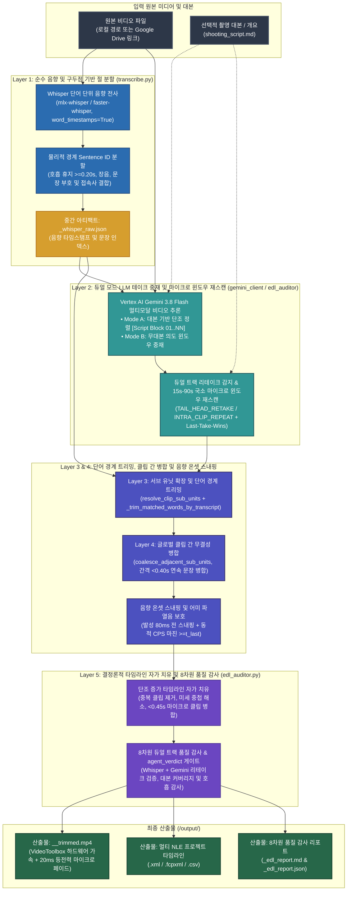

# Video Trimmer (`video-trimmer`)

[](https://github.com/sylphlin/video-trimmer/blob/main/LICENSE)
[](https://www.python.org/)
[]()
[](https://ffmpeg.org/)

[English (en)](README.md) | [繁體中文 (zh-TW)](README.zh-TW.md) | [简体中文 (zh-CN)](README.zh-CN.md) | [日本語 (ja)](README.ja.md) | [한국어 (ko)](README.ko.md)

---

## 개요 (Overview)

**Video Trimmer**는 토킹헤드 비디오, 튜토리얼 및 발표 녹화물을 위한 AI 자동 러프컷 및 트리밍 엔진입니다. **Google Vertex AI Gemini 3.8 Flash** 멀티모달 비디오 추론, **Whisper 단어 단위 음향 타임스탬프**(`mlx-whisper`), **5계층 통합 아키텍처(5-Layer Unified Architecture)** 및 **음향 온셋 스내핑(Acoustic Onset Snapping)**을 결합하여 NG 테이크, 말더듬, 무음 구간을 제거하면서 연속적인 문장 흐름을 유지하고 NLE 타임라인(`.xml`, `.fcpxml`, `.csv`), 8차원 품질 감사 보고서(`.md`, `.json`) 및 렌더링된 MP4 비디오를 생성합니다.

---

## 5계층 통합 아키텍처 및 핵심 기능



1. **계층 1: 순수 음향 및 구두점 기반 절 분할 (`transcribe.py`)**:
   - 호흡 휴지(`gap >= 0.20s`), 발화 지연 장음(`word_dur >= 1.20s`), 문장 부호 종결, 화자 교체의 물리적 경계만으로 `Sentence ID`를 분할하며, 미세 휴지(`gap < 0.25s`) 구간의 접속사 결합(`CONJUNCTIONS`)을 보존합니다. Python 문자열 유사도를 통한 의미 추측을 완전히 배제합니다.
2. **계층 2: 듀얼 모드 LLM 테이크 중재 및 국소 마이크로 윈도우 재스캔 (`gemini_client.py` / `edl_auditor.py`)**:
   - **Mode A: 대본 기반 단조 정렬 (촬영 대본 제공 시)**: 단일 진실 공급원(SSOT) 파서(`extract_script_blocks`)를 통해 YAML 프론트매터, 무대 지시문 및 비발화 메타데이터 헤더(`Title:`, `Subject:`, `Outline:`, `標題：`, `主題：`, `內文：` 등)를 제외하고 `[Script Block 01] .. [Script Block NN]`으로 구성하여 프롬프트와 감사기 간 번호를 100% 일치시키며 블록당 최대 1개의 최종 성공 테이크만 유지합니다(`Last-Take-Wins`).
   - **Mode B: 무대본 의도 윈도우 중재 (대본 미제공 시)**: 중단된 미완성 조각(Abandoned Fragment)은 제거하고 의도적인 수사적 반복 강조(3회 반복 강조 등)는 보존합니다.
   - **국소 마이크로 윈도우 재스캔 및 멀티모달 리테이크 중재 (`edl_auditor.py`)**: 대본 블록 길이 `len(block_norm)`를 유일한 분모로 커버리지를 계산합니다(`_script_block_coverage_score`). 누락된 블록, 미고정 클립, 클립 간 꼬리-머리 리테이크(`TAIL_HEAD_RETAKE`), 클립 내 반복(`INTRA_CLIP_REPEAT`), 또는 동일 블록 다중 테이크 충돌(`SCRIPT_TAKE_COLLISION`)이 감지되면 해당 `15s–90s` 구간만 `VideoMetadata`로 재스캔한 뒤 `Last-Take-Wins` 중복 제거를 수행합니다.
3. **계층 3: 서브 유닛 확장 및 단어 경계 트리밍 (`resolve_clip_sub_units`)**:
   - 다중 문장 범위를 개별 `Sentence ID`로 확장하고 `transcript`에 맞춰 시작/끝 Whisper 단어 경계(`_trim_matched_words_by_transcript`, 최우측 부분열 앵커링 및 단문 토큰 정렬)를 정밀하게 정렬합니다.
4. **계층 4: 글로벌 클립 간 무결성 병합 (`coalesce_adjacent_sub_units`)**:
   - 인접한 클립이 연속된 `Sentence ID`(중간에 건너뛴 NG 문장이 없고 경계가 리테이크로 잘리지 않은 경우)이고 물리적 단어 간격이 `< 0.40s`인 경우 단일 연속 클립으로 병합하여 문장 내부의 불필요한 점프컷을 제거합니다.
5. **계층 5: 결정론적 타임라인 자가 치유 및 8차원 듀얼 트랙 품질 감사 (`edl_auditor.py`)**:
   - 시간순 단조 증가(`source_in < source_out` 및 `c[i].source_out <= c[i+1].source_in`)를 보장하고 내포된 중복 클립 제거, 경계 미세 중첩 해소, `source_out >= t_last` 보장, `< 0.45s` 마이크로 클립 병합을 수행하며 Whisper와 Gemini 듀얼 트랙 비교를 통해 `agent_verdict` 품질 게이트가 포함된 감사 보고서(`_edl_report.md` / `_edl_report.json`)를 생성합니다.
6. **음향 온셋 스내핑, 20 ms 등전력 마이크로 크로스페이드 및 키프레임 하드웨어 가속 렌더링 (`acoustic.py` / `render.py`)**:
   - 성대 진동 80 ms 전에 컷 포인트를 배치하며, 클립별 `-ss` / `-to` 선행 키프레임 고속 탐색(불필요 구간 디코딩 생략), Apple Silicon `VideoToolbox` 하드웨어 가속(`-hwaccel videotoolbox` + `h264_videotoolbox`, `libx264` 자동 폴백 지원), 1초 GOP(`-g 30`) 및 20 ms 마이크로 페이드(`afade=t=in:d=0.020:curve=iqsin` 및 `afade=t=out:d=0.020:curve=qsin`)를 적용합니다.
7. **Agent Plugins 1.0 표준 아키텍처 및 멀티 NLE 타임라인 지원**:
   - 핵심 스크립트와 프롬프트는 `skills/video-trimmer/scripts/` 및 `skills/video-trimmer/prompts/`(SSOT)에 위치하며 에이전트 전용 CLI 옵션은 `skills/video-trimmer/SKILL.md`에 정의되어 있습니다. **FCP7 XML**, **FCPXML** 및 **CSV**를 내보냅니다.

---

## 설치 및 Google Cloud 설정

```bash
# 1. FFmpeg 설치 및 Agent Plugin으로 클론 (권장)
brew install ffmpeg
git clone https://github.com/sylphlin/video-trimmer.git ~/.gemini/config/plugins/video-trimmer

# (선택 사항) 기존 단일 Skill 디렉터리 설치 (~/.gemini/config/skills/ 호환 방식)
ln -s ~/.gemini/config/plugins/video-trimmer/skills/video-trimmer ~/.gemini/config/skills/video-trimmer

pip install -r ~/.gemini/config/plugins/video-trimmer/requirements.txt
pip install mlx-whisper

# 2. ADC 인증 및 setup.sh 실행
gcloud auth application-default login
cd ~/.gemini/config/plugins/video-trimmer
chmod +x setup.sh
./setup.sh --project YOUR_GCP_PROJECT_ID --region us-central1
```

---

## Antigravity 조작 방법 및 사용 시나리오 (Usage & Scenarios)

Antigravity에서는 다음 두 가지 방식으로 **Video Trimmer**를 사용할 수 있습니다:

1. **간결한 명령어 입력 (`/` 스킬 선택 + `@` 파일 태그, 권장)**: `/video-trimmer`를 입력하여 플러그인을 선택하고 `@`로 파일을 태그합니다. `비디오: @XX, 대본: @YY`처럼 핵심 항목만 지정하면 긴 문장을 작성할 필요가 없습니다.
2. **자연어 프롬프트 (자동 라우팅)**: 일상적인 대화체로 편집 요구 사항을 설명하면 Antigravity가 의도를 파악하여 자동으로 플러그인을 실행합니다.

기본적으로 생성된 모든 결과물은 원본 비디오 폴더 아래의 `output/` 하위 디렉터리(Google Drive 링크의 경우 `./output/`)에 자동으로 격리 저장됩니다.

### 시나리오 1: 대본/아웃라인 기반 녹화본 러프컷 (Mode A: 대본 단조 정렬)
촬영 대본이나 원고가 준비된 녹화본에 적합합니다. 대본 내 비발화 제목을 자동으로 필터링하고 각 단락의 마지막 성공 테이크(`Last-Take-Wins`)만 유지합니다.

- **간결한 `/ + @` 명령어**:
  ```text
  /video-trimmer 비디오: @raw_footage.mp4, 대본: @shooting_script.md
  ```
- **자연어 프롬프트**:
  ```text
  @shooting_script.md 대본에 맞춰 @raw_footage.mp4를 트리밍하고 말더듬과 재촬영 구간을 잘라내 주세요.
  ```

### 시나리오 2: 무대본 즉흥 토크, 인터뷰 또는 브이로그 러프컷 (Mode B: 무대본 지능형 중복 제거)
대본 없는 자유 녹화본에 적합합니다. 말하다 중단한 미완성 문장과 무음 구간을 자동으로 제거하면서 의도적인 반복 강조 표현은 보존합니다.

- **간결한 `/ + @` 명령어**:
  ```text
  /video-trimmer 비디오: @raw_footage.mp4
  ```
- **자연어 프롬프트**:
  ```text
  @raw_footage.mp4에서 말실수, 막히는 부분, 중복 시작 구간을 잘라내고 NLE 타임라인과 러프컷 영상을 내보내 주세요.
  ```

### 시나리오 3: 빠른 템포의 튜토리얼 및 쇼트폼 러프컷 (컴팩트 페이싱)
문장 사이의 호흡 휴지를 줄여야 하는 고밀도 튜토리얼이나 해설 영상에 적합합니다.

- **간결한 `/ + @` 명령어**:
  ```text
  /video-trimmer 비디오: @raw_footage.mp4, 대본: @shooting_script.md, 템포: 컴팩트
  ```
- **자연어 프롬프트**:
  ```text
  @shooting_script.md를 기준으로 컴팩트한 템포로 @raw_footage.mp4를 러프컷해 주세요.
  ```

### 시나리오 4: Google Drive 클라우드 비디오 직접 러프컷
대용량 파일을 수동으로 다운로드할 필요 없이 Google Drive 공유 링크를 직접 전달하여 러프컷을 수행합니다.

- **간결한 `/ + @` 명령어**:
  ```text
  /video-trimmer 비디오: https://drive.google.com/file/d/YOUR_FILE_ID/view, 대본: @shooting_script.md
  ```
- **자연어 프롬프트**:
  ```text
  이 Google Drive 링크의 비디오를 다운로드하여 @shooting_script.md에 맞춰 러프컷해 주세요: https://drive.google.com/file/d/YOUR_FILE_ID/view
  ```

---

## Google Drive 연동 및 GCS 2단계 수명 주기 정책

| GCS 경로 접두사 (`matchesPrefix`) | 저장 객체 | 보관 기간 (`age`) | 목적 |
| :--- | :--- | :--- | :--- |
| **`raw/`** | 스테이징된 원본 비디오 (`raw/<filename>.mp4`) | **2일 (`age: 2`)** | 추론 완료 후 즉시 삭제되며 안전 백업으로 2일 후 자동 삭제됩니다. |
| **`output/`**, **`deliverables/`**, **`trimmed/`** | 트리밍된 비디오, XML/FCPXML 타임라인 | **15일 (`age: 15`)** | 팀 검토를 위해 15일간 보관한 후 자동 삭제합니다. |

---

## 라이선스 (License)

이 프로젝트는 [MIT License](LICENSE)에 따라 라이선스가 부여됩니다.
