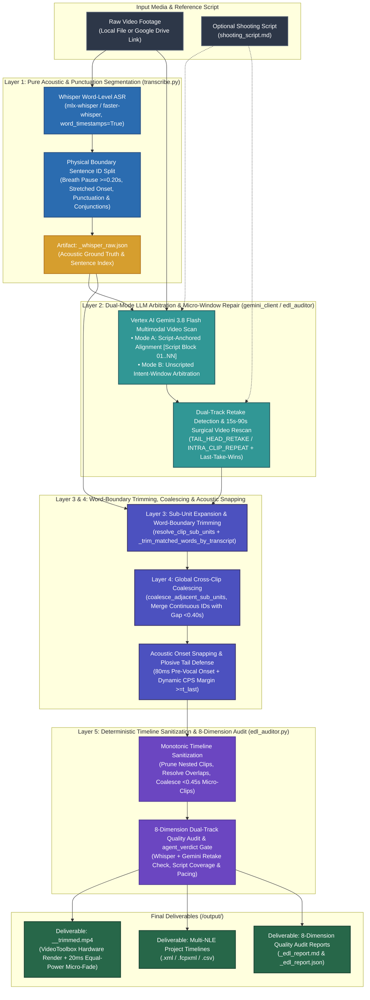

# Video Trimmer (`video-trimmer`)

[](https://github.com/sylphlin/video-trimmer/blob/main/LICENSE)
[](https://www.python.org/)
[]()
[](https://ffmpeg.org/)

[English (en)](README.md) | [繁體中文 (zh-TW)](README.zh-TW.md) | [简体中文 (zh-CN)](README.zh-CN.md) | [日本語 (ja)](README.ja.md) | [한국어 (ko)](README.ko.md)

---

## Overview

**Video Trimmer** is an automated video rough-cut and trimming engine for talking-head recordings, tutorials, and presentations. It combines **Google Vertex AI Gemini 3.8 Flash** multimodal video reasoning with **Whisper Word-Level Acoustic Ground Truth** (`mlx-whisper`), a **5-Layer Unified Architecture**, and **Acoustic Onset Snapping**. Each run removes bad takes, stutters, and dead air without truncating continuous speech, then exports NLE project timelines (`.xml`, `.fcpxml`, `.csv`), an 8-dimension quality audit report (`.md`, `.json`), and a rendered MP4 video.

---

## 5-Layer Unified Architecture & Core Capabilities



1. **Layer 1 — Pure Acoustic & Punctuation Clause Segmentation (`transcribe.py`)**:
   - Extracts phoneme-aligned word timestamps via Whisper (`mlx-whisper` on Apple Silicon Metal or `faster-whisper` on CPU/CUDA).
   - Splits `Sentence ID` units purely on physical boundaries: breath pauses (`gap >= 0.20 s`), stretched word onsets (`word_dur >= 1.20 s` and `>= 0.45 s/char`), punctuation closure, and speaker turns, while preserving conjunction attachment (`CONJUNCTIONS`) across micro-pauses (`gap < 0.25 s`).
   - Enforces a strict **Zero Python String-Similarity Rule**: Python never guesses semantic retakes via character overlap; semantic arbitration belongs exclusively to the LLM.
2. **Layer 2 — Dual-Mode LLM Take Arbitration & Surgical Micro-Window Repair (`gemini_client.py` / `edl_auditor.py`)**:
   - **Mode A: Monotonic Script-Anchored Alignment (When a Shooting Script is Provided)**: Parses the reference script with a Single Source of Truth (SSOT) parser (`extract_script_blocks`) that strips YAML frontmatter, stage directions, and non-spoken metadata headers (`Title:`, `Subject:`, `Outline:`, `標題：`, `主題：`, `內文：`). Formats spoken lines into `[Script Block 01] .. [Script Block NN]` with 100% numbering parity between the Gemini prompt and the EDL auditor, and retains at most one final complete take per block (`Last-Take-Wins`).
   - **Mode B: Unscripted Intent-Window Arbitration (When No Script is Provided)**: Groups consecutive clauses into semantic intent windows, prunes abandoned fragments and false starts, and preserves intentional rhetorical repetition (e.g., three-part emphasis).
   - **Surgical Micro-Window Repair & Multimodal Retake Arbitration (`edl_auditor.py`)**: Evaluates Mode A coverage with `len(block_norm)` as the sole denominator (`_script_block_coverage_score`). Detects missing script blocks, unanchored clips, cross-clip tail-to-head retakes (`TAIL_HEAD_RETAKE`), intra-clip repeated takes (`INTRA_CLIP_REPEAT`), and multi-take collisions (`SCRIPT_TAKE_COLLISION`), re-scans only the affected `15 s–90 s` video slice via Vertex AI `VideoMetadata(start_offset=..., end_offset=...)`, and applies `Last-Take-Wins` deduplication.
3. **Layer 3 — Sub-Unit Expansion & Transcript Word-Boundary Trimming (`resolve_clip_sub_units`)**:
   - Expands multi-sentence spans into individual `Sentence ID` sub-units so dropped NG sentences inside a time window are excluded.
   - Aligns `t_first` and `t_last` to the exact Whisper word boundaries of `clip_data["transcript"]` (`_trim_matched_words_by_transcript`, using rightmost subsequence anchoring and short-token alignment) when the LLM trims a boundary stumble.
4. **Layer 4 — Global Cross-Clip Coalescing (`coalesce_adjacent_sub_units`)**:
   - Merges consecutive `Sentence ID`s across adjacent EDL clips when the physical inter-word gap is `< 0.40 s`, no `Sentence ID` was skipped, and neither boundary was trimmed for a retake, eliminating artificial internal jump-cuts and redundant micro-fades inside continuous sentences.
5. **Layer 5 — Deterministic Timeline Sanitization & 8-Dimension Dual-Track Quality Audit (`edl_auditor.py`)**:
   - Enforces strict chronological monotonicity (`source_in < source_out` and `c[i].source_out <= c[i+1].source_in`), prunes nested/contained redundant clips, guarantees `source_out >= t_last` (plosive tail floor), merges `< 0.45 s` flash-frame micro-clips, and generates an 8-dimension dual-track (Whisper + Gemini) rough-cut audit report (`_edl_report.md` and `_edl_report.json`) with a top-level `agent_verdict` quality gate.
6. **Acoustic Onset Snapping & Plosive Tail Defense (`acoustic.py`)**:
   - Places cut-in points 80 ms before vocal cord vibration and dynamically calculates lead-in/lead-out margins from presenter Characters Per Second (CPS) while enforcing `true_speech_end >= t_last`.
7. **20 ms Audio Equal-Power Micro-Crossfade & Keyframe Hardware Rendering (`render.py`)**:
   - Uses per-clip fast keyframe input seeking (`-ss`/`-to` before `-i`) to skip discarded footage without decoding it, combined with Apple Silicon `VideoToolbox` hardware decoding/encoding (`-hwaccel videotoolbox` + `h264_videotoolbox` with `libx264` fallback), a 1-second GOP (`-g 30`), and 20 ms equal-power micro-fades (`afade=t=in:d=0.020:curve=iqsin` and `afade=t=out:d=0.020:curve=qsin`) at every cut boundary.
8. **Multi-NLE Timeline Interoperability (`exporters.py`)**:
   - Exports frame-accurate **Final Cut Pro 7 XML** (`.xml` for Adobe Premiere Pro and DaVinci Resolve), **Apple Final Cut Pro FCPXML** (`.fcpxml`), and **CSV** cut lists across standard frame rates (`23.976` to `60` fps).

---

## Project Structure (Agent Plugins 1.0 Specification)

```text
video-trimmer/
├── plugin.json                              # Agent Plugins 1.0 manifest
├── rules/
│   └── AGENTS.md                            # Packaged client execution invariants (read-only & fail-fast)
├── skills/
│   └── video-trimmer/                       # Canonical Skill Bundle (Single Source of Truth)
│       ├── SKILL.md                         # Agent Skill specification & CLI options reference for AI agents
│       ├── scripts/                         # Canonical core engine modules (SSOT)
│       │   ├── __init__.py
│       │   ├── video_trimmer.py             # CLI parser and 5-layer pipeline orchestrator
│       │   ├── constants.py                 # Named constants
│       │   ├── exceptions.py                # Exception hierarchy
│       │   ├── acoustic.py                  # CPS calculation, onset snapping, and tail margins
│       │   ├── transcribe.py                # Acoustic clause segmentation, word trimming, and coalescing
│       │   ├── edl_auditor.py               # Surgical micro-window repair, timing sanitizer, and 8-D audit
│       │   ├── gemini_client.py             # Vertex AI (ADC) client and dual-mode prompt builder
│       │   ├── gcs_utils.py                 # Cloud Storage staging, Google Drive cache, and CJK recovery
│       │   ├── exporters.py                 # FCP7 XML, FCPXML, and CSV timeline exporters
│       │   └── render.py                    # ffprobe inspection and FFmpeg micro-crossfade rendering
│       └── prompts/                         # Canonical prompt specifications (SSOT)
│           └── video_cut_prompt.md          # Dual-mode take arbitration & 5-rule subtraction prompt
├── AGENTS.md                                # Workspace & engineering development rules (Part I & Part II)
├── README.md                                # English documentation
├── LICENSE                                  # MIT License
├── .env.example                             # Environment variables template for Vertex AI and GCS
├── setup.sh                                 # Native gcloud provisioning script (Zero Terraform)
├── pyproject.toml                           # PEP 621 Python package configuration
├── requirements.txt                         # Python dependencies
└── tests/                                   # Offline unit test suite (103 tests)
```

---

## Installation & Google Cloud Setup

### 1. Install FFmpeg

Install [FFmpeg](https://ffmpeg.org/) and verify that `ffmpeg` and `ffprobe` are in `PATH`:

```bash
# macOS (Homebrew)
brew install ffmpeg

# Ubuntu / Debian
sudo apt update && sudo apt install -y ffmpeg
```

### 2. Install as an Antigravity Plugin

```bash
# Global Plugin (Recommended)
git clone https://github.com/sylphlin/video-trimmer.git ~/.gemini/config/plugins/video-trimmer

# Or Workspace Plugin
git clone https://github.com/sylphlin/video-trimmer.git .agents/plugins/video-trimmer

# Legacy Single-Skill Installation (~/.gemini/config/skills/)
ln -s ~/.gemini/config/plugins/video-trimmer/skills/video-trimmer ~/.gemini/config/skills/video-trimmer

# Install Python Dependencies and Apple Silicon Metal Acceleration
pip install -r ~/.gemini/config/plugins/video-trimmer/requirements.txt
pip install mlx-whisper
```

### 3. Provision Google Cloud Resources (`./setup.sh`)

Run `setup.sh` to configure Vertex AI, Cloud Storage, and Application Default Credentials (ADC) using native `gcloud` commands:

```bash
# Authenticate ADC
gcloud auth application-default login

# Provision GCS bucket, CORS, two-tier lifecycle rules (raw: 2d, deliverables: 15d), IAM, and .env
cd ~/.gemini/config/plugins/video-trimmer
chmod +x setup.sh
./setup.sh --project YOUR_GCP_PROJECT_ID --region us-central1
```

---

## Antigravity Usage & Scenarios

You can operate **Video Trimmer** in Antigravity using two interaction modes:

1. **Concise `/skill` + `@file` Invocation (Recommended)**: Type `/video-trimmer` to select the plugin and tag your files with `@`. Specify only the key parameters (for example, `Video: @XX, Script: @YY`) without writing full sentences.
2. **Natural Language Prompt (Auto-Routed)**: Describe your editing goal in plain conversational language. Antigravity automatically selects and runs this plugin.

By default, all generated deliverables are isolated in the `output/` subdirectory next to the input video (`./output/` for Google Drive links).

### Scenario 1: Script-Guided Recording Rough-Cut (Mode A: Monotonic Script-Anchored Alignment)
Use this scenario when you have a shooting script or outline. The agent strips non-spoken metadata headers, aligns every spoken block in order, and keeps the final complete take for each block.

- **Concise `/ + @` Command**:
  ```text
  /video-trimmer Video: @raw_footage.mp4, Script: @shooting_script.md
  ```
- **Natural Language Prompt**:
  ```text
  Trim @raw_footage.mp4 using @shooting_script.md as the reference script, and remove all stutters and retakes.
  ```

### Scenario 2: Unscripted Talking-Head, Interview, or Vlog Rough-Cut (Mode B: Unscripted Intent-Window Arbitration)
Use this scenario for free-form recordings without a script. The agent removes false starts, stutters, and dead air while preserving intentional rhetorical repetition.

- **Concise `/ + @` Command**:
  ```text
  /video-trimmer Video: @raw_footage.mp4
  ```
- **Natural Language Prompt**:
  ```text
  Clean up @raw_footage.mp4 by removing bad takes, stutters, and dead air, and export the NLE timelines and rough-cut MP4.
  ```

### Scenario 3: Fast-Paced Tutorial or Explainer Rough-Cut (Compact Pacing)
Use this scenario for high-density tutorials where tighter inter-sentence pauses are desired.

- **Concise `/ + @` Command**:
  ```text
  /video-trimmer Video: @raw_footage.mp4, Script: @shooting_script.md, Pacing: compact
  ```
- **Natural Language Prompt**:
  ```text
  Rough-cut @raw_footage.mp4 with compact pacing against @shooting_script.md.
  ```

### Scenario 4: Direct Rough-Cut from a Google Drive Share Link
Pass a Google Drive URL directly without manually downloading large video files first.

- **Concise `/ + @` Command**:
  ```text
  /video-trimmer Video: https://drive.google.com/file/d/YOUR_FILE_ID/view, Script: @shooting_script.md
  ```
- **Natural Language Prompt**:
  ```text
  Download this Google Drive video and rough-cut it against @shooting_script.md: https://drive.google.com/file/d/YOUR_FILE_ID/view
  ```

---

## Generated Deliverables

For an input video `raw_footage.mp4`, the agent automatically creates an `output/` subdirectory next to the source video and delivers:

1. **`output/raw_footage_<tag>_trimmed.mp4`**: Rendered rough-cut video with 20 ms equal-power audio crossfades.
2. **`output/raw_footage_<tag>_edl.xml`**: Final Cut Pro 7 XML timeline for **Adobe Premiere Pro** and **DaVinci Resolve**.
3. **`output/raw_footage_<tag>_edl.fcpxml`**: Apple FCPXML timeline for **Final Cut Pro**.
4. **`output/raw_footage_<tag>_edl.json`** & **`_edl.csv`**: Structured decision metadata and spreadsheet cut table with editorial notes.
5. **`output/raw_footage_<tag>_edl_report.md`** & **`_edl_report.json`**: 8-dimension rough-cut quality audit report with top-level `agent_verdict`.
6. **`output/raw_footage_whisper_raw.json`**: Cached Whisper word-level transcript.

---

## Two-Tier GCS Bucket Lifecycle Policy (`gs://video-preprocessing-${PROJECT_ID}`)

| GCS Prefix (`matchesPrefix`) | Stored Objects | Retention (`age`) | Purpose |
| :--- | :--- | :--- | :--- |
| **`raw/`** | Staged raw videos (`raw/<filename>.mp4`) | **2 Days (`age: 2`)** | Keeps temporary staged media for 2 days as a safety backstop (normal runs delete staged objects immediately in `finally` blocks). |
| **`output/`**, **`deliverables/`**, **`trimmed/`** | Trimmed videos, XML/FCPXML timelines, and EDL reports | **15 Days (`age: 15`)** | Retains deliverables for 15 days for team review before automatic deletion. |

---

## Unit Testing

Run the offline test suite (103 tests) before committing changes:

```bash
python3 -m unittest discover -s tests -v
```

---

## License

This project is licensed under the [MIT License](LICENSE).
