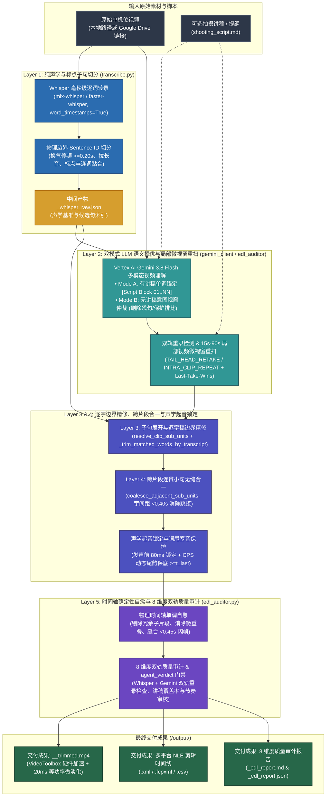

# Video Trimmer (`video-trimmer`)

[](https://github.com/sylphlin/video-trimmer/blob/main/LICENSE)
[](https://www.python.org/)
[]()
[](https://ffmpeg.org/)

[English (en)](README.md) | [繁體中文 (zh-TW)](README.zh-TW.md) | [简体中文 (zh-CN)](README.zh-CN.md) | [日本語 (ja)](README.ja.md) | [한국어 (ko)](README.ko.md)

---

## 项目概览 (Overview)

**Video Trimmer** 是面向口播视频、教程与演讲录像的 AI 自动粗剪引擎。系统结合 **Google Vertex AI Gemini 3.8 Flash** 多模态视频推理、**Whisper 逐字声学时间戳**（`mlx-whisper`）、**五层统一剪辑架构（5-Layer Unified Architecture）** 与 **声学起音锁定（Acoustic Onset Snapping）**。每次运行会自动剔除 NG 重录、口误与静音停顿，同时保护连贯长句不被切碎，并导出专业 NLE 时间线（`.xml`, `.fcpxml`, `.csv`）、8 维度质量审计报告（`.md`, `.json`）及渲染完成的 MP4 视频。

---

## 五层统一剪辑架构与核心技术能力



1. **第一层：纯声学与标点子句切分 (`transcribe.py`)**：
   - 仅依据物理边界切分 `Sentence ID`：换气停顿（`gap >= 0.20s`）、吃螺丝拉长音起音（`word_dur >= 1.20s`）、句尾标点与说话人轮替，同时保留微停顿（`gap < 0.25s`）下的连词黏合（`CONJUNCTIONS`）。绝不在 Python 中使用字符串相似度猜测 NG 重录。
2. **第二层：双模式 LLM 语义择优与局部微视窗精准重扫 (`gemini_client.py` / `edl_auditor.py`)**：
   - **Mode A：有讲稿单调锚定模式（提供拍摄讲稿时）**：通过单一真相来源（SSOT）解析器（`extract_script_blocks`）自动过滤 YAML Frontmatter、舞台指示与非口播元数据行（如 `标题：`、`主题：`、`大纲：`、`内文：`、`Title:`、`Subject:`、`Outline:`），将口播台词格式化为 `[Script Block 01] .. [Script Block NN]`，确保提示词与审计器编号 100% 一致，且每个段落最多保留最后一次完整成功的 Take（`Last-Take-Wins`）。
   - **Mode B：无讲稿意图视窗仲裁模式（未提供讲稿时）**：剔除未完成残句重录（Abandoned Fragment），同时保护刻意修辞排比强调（如三遍重复强调）。
   - **局部小视窗精准重扫与多模态重录仲裁（`edl_auditor.py`）**：以完整讲稿段落长度为唯一分母计算覆盖率（`_script_block_coverage_score`）；若检测到遗漏段落、未锚定片段、跨片段句尾重讲（`TAIL_HEAD_RETAKE`）、单一片段内部重复（`INTRA_CLIP_REPEAT`）或同段多 Take 冲突（`SCRIPT_TAKE_COLLISION`），仅针对该 `15s–90s` 局部视窗通过 `VideoMetadata` 发起单次重扫，并执行 `Last-Take-Wins` 去重。
3. **第三层：子句展开与逐字稿边界精修 (`resolve_clip_sub_units`)**：
   - 将多句跨度展开为独立的 `Sentence ID` 子单元，并依据 `transcript` 自动精修首尾词边界（`_trim_matched_words_by_transcript`，支持最右侧子序列锚定与短词对齐）。
4. **第四层：跨片段连贯小句无缝合一 (`coalesce_adjacent_sub_units`)**：
   - 当相邻片段为连续 `Sentence ID`（中间未跳过 NG 句且边界未经口误裁剪）且物理字间距 `< 0.40s` 时，自动合并为单一连续片段，消除长句内部的跳接（Jump-Cut）。
5. **第五层：物理时间轴确定性自愈与 8 维度双轨质量审计 (`edl_auditor.py`)**：
   - 强制按时间单调递增排序（`source_in < source_out` 且 `c[i].source_out <= c[i+1].source_in`）、剔除被包裹的冗余子片段、消除相邻边界微重叠、强制保底 `source_out >= t_last`、合并 `< 0.45s` 闪帧微碎切，并结合 Whisper 与 Gemini 双轨文本比对生成 `<base>_<tag>_edl_report.md` 与含顶层 `agent_verdict` 质量门禁的 `<base>_<tag>_edl_report.json`。
6. **声学起音锁定、20 ms 等功率微交叉淡化与关键帧硬件加速渲染 (`acoustic.py` / `render.py`)**：
   - 将剪辑入点锁定在声带振动前 80 ms；成片渲染采用每片段前置 `-ss` / `-to` 关键帧快速定位（跳过废片解码）、Apple Silicon `VideoToolbox` 硬件编解码（`-hwaccel videotoolbox` + `h264_videotoolbox`，支持 `libx264` 自动降级）、1 秒 GOP（`-g 30`）与 20 ms 等功率淡入淡出（`afade=t=in:d=0.020:curve=iqsin` 与 `afade=t=out:d=0.020:curve=qsin`）。
7. **Agent Plugins 1.0 标准架构与多平台 NLE 时间线导出**：
   - 核心代码与提示词位于 `skills/video-trimmer/scripts/` 与 `skills/video-trimmer/prompts/`（SSOT），Agent 专用 CLI 参数定义于 `skills/video-trimmer/SKILL.md`，支持导出 **FCP7 XML**、**FCPXML** 与 **CSV**。

---

## 安装与 Google Cloud 环境配置

```bash
# 1. 安装 FFmpeg 与克隆 Agent Plugin（推荐）
brew install ffmpeg
git clone https://github.com/sylphlin/video-trimmer.git ~/.gemini/config/plugins/video-trimmer

# （可选）旧版独立 Skill 目录安装（~/.gemini/config/skills/ 兼容方式）
ln -s ~/.gemini/config/plugins/video-trimmer/skills/video-trimmer ~/.gemini/config/skills/video-trimmer

pip install -r ~/.gemini/config/plugins/video-trimmer/requirements.txt
pip install mlx-whisper

# 2. 授权 ADC 并运行 setup.sh
gcloud auth application-default login
cd ~/.gemini/config/plugins/video-trimmer
chmod +x setup.sh
./setup.sh --project YOUR_GCP_PROJECT_ID --region us-central1
```

---

## Antigravity 操作方式与使用场景 (Usage & Scenarios)

在 Antigravity 中，您可以通过以下两种方式操作 **Video Trimmer**：

1. **极简指令（`/` 指定技能 + `@` 标记文件，推荐）**：输入 `/video-trimmer` 选择技能，并用 `@` 标记视频与讲稿文件，只需列出关键字段（如 `视频: @XX, 讲稿: @YY`），无需编写完整句子。
2. **口语表达（自然语言自动触发）**：直接用日常口语描述剪辑需求，Antigravity 会自动识别意图并调用该 Plugin。

默认情况下，所有生成文件均会自动隔离保存至输入视频所在目录下的 `output/` 子目录（Google Drive 链接则为 `./output/`）。

### 场景 1：有讲稿 / 大纲的录像粗剪（Mode A：讲稿锚定对齐）
适用于已备妥拍摄脚本或口播大纲的录像，系统会自动过滤脚本内的非口播标题，按顺序对齐每个段落并保留最后一次完整成功的 Take。

- **极简指令**：
  ```text
  /video-trimmer 视频: @raw_footage.mp4, 讲稿: @shooting_script.md
  ```
- **口语表达**：
  ```text
  帮我照着 @shooting_script.md 修剪 @raw_footage.mp4，剪掉吃螺丝和重录片段。
  ```

### 场景 2：无讲稿的即兴口播、访谈或 Vlog 粗剪（Mode B：无稿智能去重）
适用于无脚本的自由发挥录像，系统会自动剔除说到一半放弃重讲的残句与空白停顿，同时保留刻意排比强调的语句。

- **极简指令**：
  ```text
  /video-trimmer 视频: @raw_footage.mp4
  ```
- **口语表达**：
  ```text
  请帮我把 @raw_footage.mp4 里面的口误、卡词跟重复开头剪掉，导出剪辑时间线与粗剪视频。
  ```

### 场景 3：快节奏教程或短视频粗剪（紧凑节奏模式）
适用于需要缩短句间换气停顿的高密度教程或解说视频。

- **极简指令**：
  ```text
  /video-trimmer 视频: @raw_footage.mp4, 讲稿: @shooting_script.md, 节奏: 紧凑
  ```
- **口语表达**：
  ```text
  请用紧凑节奏帮我粗剪 @raw_footage.mp4，并对照 @shooting_script.md 去除重讲片段。
  ```

### 场景 4：Google Drive 云端视频直接粗剪
无需手动下载大文件，直接提供 Google Drive 分享链接即可自动完成下载缓存、声学对齐与云端粗剪。

- **极简指令**：
  ```text
  /video-trimmer 视频: https://drive.google.com/file/d/YOUR_FILE_ID/view, 讲稿: @shooting_script.md
  ```
- **口语表达**：
  ```text
  帮我下载这个 Google Drive 链接的视频并对照 @shooting_script.md 完成粗剪：https://drive.google.com/file/d/YOUR_FILE_ID/view
  ```

---

## Google Drive 直连与 GCS 双层生命周期规则

| GCS 路径前缀 (`matchesPrefix`) | 存储对象 | 保留天数 (`age`) | 说明 |
| :--- | :--- | :--- | :--- |
| **`raw/`** | 暂存原始视频 (`raw/<filename>.mp4`) | **2 天 (`age: 2`)** | 推理后立即删除，并以 2 天自动清理规则作为安全兜底。 |
| **`output/`**、**`deliverables/`**、**`trimmed/`** | 粗剪视频、XML/FCPXML 时间线与报告 | **15 天 (`age: 15`)** | 保留 15 天供团队审阅，到期自动清理。 |

---

## 许可证 (License)

本项目采用 [MIT License](LICENSE) 授权。
