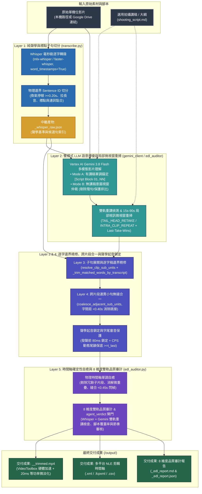

# Video Trimmer (`video-trimmer`)

[](https://github.com/sylphlin/video-trimmer/blob/main/LICENSE)
[](https://www.python.org/)
[]()
[](https://ffmpeg.org/)

[English (en)](README.md) | [繁體中文 (zh-TW)](README.zh-TW.md) | [简体中文 (zh-CN)](README.zh-CN.md) | [日本語 (ja)](README.ja.md) | [한국어 (ko)](README.ko.md)

---

## 專案總覽 (Overview)

**Video Trimmer** 是專為單機位口播、教學影片與演講錄影設計的 AI 自動粗剪與去蕪存菁引擎。系統結合 **Google Vertex AI Gemini 3.8 Flash** 原生多模態影片理解、**Whisper 毫秒級逐字聲學時間戳**（Apple Silicon Metal `mlx-whisper` 加速）、**五層統一剪輯架構（5-Layer Unified Architecture）** 以及 **聲學起音鎖定（Acoustic Onset Snapping）**。每次執行會自動剔除 NG 重錄、吃螺絲與無效停頓，同時保護連貫長句不被切碎，並匯出多格式專業剪輯時間軸（`.xml`, `.fcpxml`, `.csv`）、8 維度品質審計報告（`.md`, `.json`）與完成粗剪的 MP4 影片。

---

## 五層統一剪輯架構與核心技術特點



1. **第一層：純聲學與標點子句切分 (`transcribe.py`)**：
   - 透過 Whisper 提取逐字時間戳，僅依據物理邊界切分 `Sentence ID`：換氣停頓（`gap >= 0.20s`）、吃螺絲拉長音起音（`word_dur >= 1.20s` 且單字元 `>= 0.45s`）、句尾標點與說話者輪替，同時保留微停頓（`gap < 0.25s`）下的連詞黏合（`CONJUNCTIONS`）。
   - **零 Python 語意猜測原則**：絕不在 Python 端使用字串相似度猜測 NG 重講，語意判斷 100% 交由 LLM 處理。
2. **第二層：雙模式 LLM 語意擇優與局部微視窗精準重掃 (`gemini_client.py` / `edl_auditor.py`)**：
   - **Mode A：有講稿單調錨定模式（提供拍攝講稿時）**：採用單一真相來源（SSOT）講稿解析器（`extract_script_blocks`），自動過濾 YAML Frontmatter、鏡位指示與非口播屬性欄位（如 `標題：`、`主題：`、`大綱：`、`內文：`、`Title:`、`Subject:`、`Outline:`），將實際口播台詞切分為 `[Script Block 01] .. [Script Block NN]`，確保 Gemini 提示詞與審計器編號 100% 一致，並針對每個講稿段落最多保留最後一次完整成功的 Take（`Last-Take-Wins`）。
   - **Mode B：無講稿意圖視窗仲裁模式（未提供講稿時）**：以局部語意視窗識別「未完成殘句重講（Abandoned Fragment）」並予以剔除，同時保護「刻意修辭排比強調（如：請訂閱、請訂閱、請訂閱）」不被誤刪。
   - **局部小視窗精準重掃與多模態重錄仲裁（`edl_auditor.py`）**：以完整講稿段落長度 `len(block_norm)` 為唯一分母計算分段覆蓋率（`_script_block_coverage_score`）；若偵測到遺漏段落、未錨定片段、跨片段句尾重講（`TAIL_HEAD_RETAKE`）、單一片段內部重複（`INTRA_CLIP_REPEAT`）或同段多 Take 衝突（`SCRIPT_TAKE_COLLISION`），僅針對該 `15s–90s` 局部視訊區間透過 `VideoMetadata(start_offset=..., end_offset=...)` 發起單次重掃，並執行 `Last-Take-Wins` 去重。
3. **第三層：子句展開與逐字稿邊界精修 (`resolve_clip_sub_units`)**：
   - 將多句跨度自動展開為獨立的 `Sentence ID` 子單元，自動略過時間區間內未被選中的 NG 句。
   - 當 LLM 在 `transcript` 欄位修剪了句首吃螺絲或句尾殘句時，透過 `_trim_matched_words_by_transcript`（最右側子序列錨定與短詞對齊）自動將 `t_first` 與 `t_last` 對齊至實際保留字詞的 Whisper 邊界。
4. **第四層：跨片段連貫小句無縫合一 (`coalesce_adjacent_sub_units`)**：
   - 當相鄰片段為連續 `Sentence ID`（中間未跳過任何 NG 句、且邊界未經過口誤修剪）且物理字間距 `< 0.40s` 時，自動合併為單一連續片段，消除長句內部的無謂跳接（Jump-Cut）與多餘微淡化。
5. **第五層：物理時間軸確定性自癒與 8 維度雙軌品質審計 (`edl_auditor.py`)**：
   - 強制依時間軸單調遞增排序（`source_in < source_out` 且 `c[i].source_out <= c[i+1].source_in`）、自動剔除被包裹的冗餘子片段、消解相鄰邊界微重疊、強制保底 `source_out >= t_last`（保護字尾塞音）、自動縫合 `< 0.45s` 閃幀微碎切，並結合 Whisper 與 Gemini 雙軌文字比對輸出 `<base>_<tag>_edl_report.md` 與含頂層 `agent_verdict` 品質閘門的 `<base>_<tag>_edl_report.json`。
6. **聲學起音鎖定與字尾塞音保護 (`acoustic.py`)**：
   - 將剪輯入點鎖定於聲帶發聲前 80 ms，並依據講者語速（CPS）動態計算緩衝邊界，強制 `true_speech_end >= t_last` 以保護字尾無聲除阻音與鼻音。
7. **20 ms 等功率音訊微淡化與關鍵幀硬體加速渲染 (`render.py`)**：
   - 每個保留片段採用前置 `-ss` / `-to` 關鍵幀快速定位（Fast Input Seeking，免除廢片區段解碼），結合 Apple Silicon `VideoToolbox` 硬體編解碼（`-hwaccel videotoolbox` + `h264_videotoolbox`，具備 `libx264` 自動降級備援）、1 秒關鍵幀間距（`-g 30`）與 20 ms 等功率淡入淡出（`afade=t=in:d=0.020:curve=iqsin` 與 `afade=t=out:d=0.020:curve=qsin`），消除跳接爆音並大幅提升成片渲染與快轉速度。
8. **多平台 NLE 時間軸匯出 (`exporters.py`)**：
   - 支援匯出 **Final Cut Pro 7 XML**（`.xml`，適用於 Adobe Premiere Pro 與 DaVinci Resolve）、**Apple Final Cut Pro FCPXML**（`.fcpxml`）與 **CSV** 剪輯表。

---

## 專案目錄結構（Agent Plugins 1.0 標準規範）

```text
video-trimmer/
├── plugin.json                              # Agent Plugins 1.0 宣告清單
├── rules/
│   └── AGENTS.md                            # 打包於 Plugin 內的客戶端執行期守則（唯讀與 Fail-Fast）
├── skills/
│   └── video-trimmer/                       # 標準技能套件主幹（Single Source of Truth）
│       ├── SKILL.md                         # 技能規範與 Agent 專用 CLI 參數參考手冊
│       ├── scripts/                         # 核心引擎模組實體目錄 (SSOT)
│       │   ├── __init__.py
│       │   ├── video_trimmer.py             # CLI 解析與五層管線協調器
│       │   ├── acoustic.py                  # CPS 語速計算、聲學起音鎖定與字尾保護
│       │   ├── transcribe.py                # 聲學切句、逐字邊界精修與跨片段無縫合一
│       │   ├── edl_auditor.py               # 局部小視窗精準重掃、時間軸自癒與 8 維度品質審計
│       │   ├── gemini_client.py             # Vertex AI (ADC) 客戶端與雙模式提示詞建構
│       │   ├── gcs_utils.py                 # GCS 暫存、Google Drive 快取與中文檔名修復
│       │   ├── exporters.py                 # FCP7 XML、FCPXML 與 CSV 時間軸匯出
│       │   └── render.py                    # ffprobe 檢測與 FFmpeg 20ms 微淡化渲染
│       └── prompts/                         # 提示詞規範實體目錄 (SSOT)
│           └── video_cut_prompt.md          # 雙模式語意仲裁與五律減法剪輯規範
├── AGENTS.md                                # 工作區與開發工程規範（Part I 執行守則 & Part II 開發規範）
├── setup.sh                                 # 原生 gcloud 雲端環境一鍵配置腳本
└── tests/                                   # 離線單元測試套件（103 項測試）
```

---

## 安裝與 Google Cloud 環境設定

### 1. 安裝 FFmpeg

```bash
# macOS (Homebrew)
brew install ffmpeg

# Ubuntu / Debian
sudo apt update && sudo apt install -y ffmpeg
```

### 2. 安裝為 Antigravity Plugin

```bash
# 全域 Antigravity Plugin（建議）
git clone https://github.com/sylphlin/video-trimmer.git ~/.gemini/config/plugins/video-trimmer

# 舊版獨立 Skill 目錄安裝（~/.gemini/config/skills/ 相容方式）
ln -s ~/.gemini/config/plugins/video-trimmer/skills/video-trimmer ~/.gemini/config/skills/video-trimmer

# 安裝 Python 相依套件與 Apple Silicon Metal 加速
pip install -r ~/.gemini/config/plugins/video-trimmer/requirements.txt
pip install mlx-whisper
```

### 3. 一鍵配置 Google Cloud 資源 (`./setup.sh`)

```bash
gcloud auth application-default login
cd ~/.gemini/config/plugins/video-trimmer
chmod +x setup.sh
./setup.sh --project YOUR_GCP_PROJECT_ID --region us-central1
```

---

## Antigravity 操作方式與使用情境 (Usage & Scenarios)

在 Antigravity 中，您可以透過以下兩種方式操作 **Video Trimmer**：

1. **極簡指令（`/` 指定技能 + `@` 標記檔案，推薦）**：輸入 `/video-trimmer` 選取技能，並用 `@` 標記影片與講稿檔案，僅需列出關鍵欄位（如 `影片: @XX, 講稿: @YY`），無須撰寫完整句子。
2. **口語表達（自然語言自動觸發）**：直接用日常口語描述剪輯需求，Antigravity 會自動識別意圖並呼叫此 Plugin。

所有產出檔案（`_trimmed.mp4`、`.xml`、`.fcpxml`、`.json`、`.csv`、`_edl_report.md` 與 `_edl_report.json`）預設皆會自動隔離儲存於原始影片目錄下的 `output/` 子目錄（Google Drive 連結則為 `./output/`）。

### 情境 1：有講稿 / 大綱的錄影粗剪（Mode A：講稿錨定對齊）
適用於已備妥拍攝腳本或口播大綱的錄影，系統會自動過濾腳本內的非口播標題，依序對齊每個段落並保留最後一次完整成功的 Take。

- **極簡指令**：
  ```text
  /video-trimmer 影片: @raw_footage.mp4, 講稿: @shooting_script.md
  ```
- **口語表達**：
  ```text
  幫我照著 @shooting_script.md 修剪 @raw_footage.mp4，剪掉吃螺絲和重錄片段。
  ```

### 情境 2：無講稿的即興口播、訪談或 Vlog 粗剪（Mode B：無稿智慧去重）
適用於無腳本的自由發揮錄影，系統會自動剔除說到一半放棄重講的殘句與空白停頓，同時保留刻意排比強調的語句。

- **極簡指令**：
  ```text
  /video-trimmer 影片: @raw_footage.mp4
  ```
- **口語表達**：
  ```text
  請幫我把 @raw_footage.mp4 裡面的口誤、卡詞跟重複開頭剪掉，匯出剪輯時間軸與粗剪影片。
  ```

### 情境 3：快節奏教學或短影音粗剪（緊湊節奏模式）
適用於需要縮短句間換氣停頓的高密度教學或解說影片。

- **極簡指令**：
  ```text
  /video-trimmer 影片: @raw_footage.mp4, 講稿: @shooting_script.md, 節奏: 緊湊
  ```
- **口語表達**：
  ```text
  請用緊湊節奏幫我粗剪 @raw_footage.mp4，並對照 @shooting_script.md 去除重講片段。
  ```

### 情境 4：Google Drive 雲端影片直接粗剪
無須手動下載大檔案，直接提供 Google Drive 分享連結即可自動完成下載快取、聲學對齊與雲端粗剪。

- **極簡指令**：
  ```text
  /video-trimmer 影片: https://drive.google.com/file/d/YOUR_FILE_ID/view, 講稿: @shooting_script.md
  ```
- **口語表達**：
  ```text
  幫我下載這個 Google Drive 連結的影片並對照 @shooting_script.md 完成粗剪：https://drive.google.com/file/d/YOUR_FILE_ID/view
  ```

---

## 自動交付成果 (Generated Deliverables)

每次執行完成後，Agent 會在 `output/` 目錄下產出並驗證以下檔案：

1. **`<basename>_<tag>_trimmed.mp4`**：套用 20 ms 等功率音訊微淡化、可直接播放的粗剪成品影片。
2. **`<basename>_<tag>_edl.xml`**：適用於 **Adobe Premiere Pro** 與 **DaVinci Resolve** 的 Final Cut Pro 7 XML 時間軸。
3. **`<basename>_<tag>_edl.fcpxml`**：適用於 **Apple Final Cut Pro** 的 FCPXML 時間軸。
4. **`<basename>_<tag>_edl.json`** / **`<basename>_<tag>_edl.csv`**：結構化剪輯決策資料與試算表剪輯清單。
5. **`<basename>_<tag>_edl_report.md`** / **`.json`**：8 維度粗剪品質審計報告與 `agent_verdict` 自動化品質閘門結果。

---

## Google Drive 分享連結與 GCS 雙層生命週期規則

| GCS 路徑前綴 (`matchesPrefix`) | 儲存內容 | 保留天數 (`age`) | 規則說明 |
| :--- | :--- | :--- | :--- |
| **`raw/`** | 暫存原始影片 (`raw/<filename>.mp4`) | **2 天 (`age: 2`)** | 推論完成後於 `finally` 區塊立即刪除，並以 2 天自動刪除規則作為安全備援。 |
| **`output/`**、**`deliverables/`**、**`trimmed/`** | 粗剪影片、XML/FCPXML 時間軸與 EDL 報告 | **15 天 (`age: 15`)** | 保留 15 天供團隊審閱與下載，期滿自動清理。 |

---

## 單元測試 (Unit Testing)

```bash
python3 -m unittest discover -s tests -v
```

---

## 授權條款 (License)

本專案採用 [MIT License](LICENSE) 授權。
